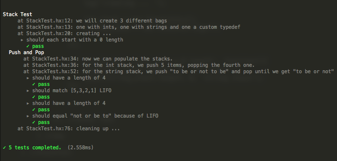
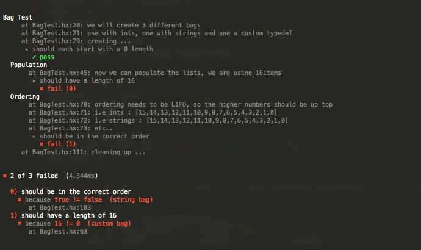

### mohxa is a testing library for [Haxe](http://haxe.org/)
---
A BDD style test library based closely on http://visionmedia.github.io/mocha/

(still pronounced mocha)

###Features
---

- nested test groups
- before, after, beforeEach, afterEach per group
- formatted logging from inside tests
- `equal` helper

to do :    
async callbacks, other reporting (json etc).

**NOTE** 
Tested on neko + cpp only.
On C++ -debug flag is required for Stack traces.

###How does it look?

```haxe
import structural.Stack;

class StackTest extends Mohxa {

    public function new() {

        super();

        describe('Stack Test', function(){

            log('we will create 2 different stacks');
            log('one with ints, one with strings');

            var int_stack : Stack<Int>;
            var string_stack : Stack<String>;

            before(function(){

                log('creating ... ');

                int_stack = new Stack<Int>();
                string_stack = new Stack<String>();

            });

            it('should each start with a 0 length', function(){
                equal(int_stack.length, 0, 'int stack');
                equal(string_stack.length, 0, 'string stack');
            });

            ...

        }); //Stack Test

    } //new

} //StackTest
```

### How does the output look?





---

### Install options

`haxelib install mohxa`   
`haxelib git mohxa https://github.com/underscorediscovery/mohxa.git`    
`haxelib local mohxa /path/to/mohxa-1.0.0.zip` (from releases)   
 

### History
1.0.0 - Initial release

### That's it

- Suggestions, issues, bugs welcome.

